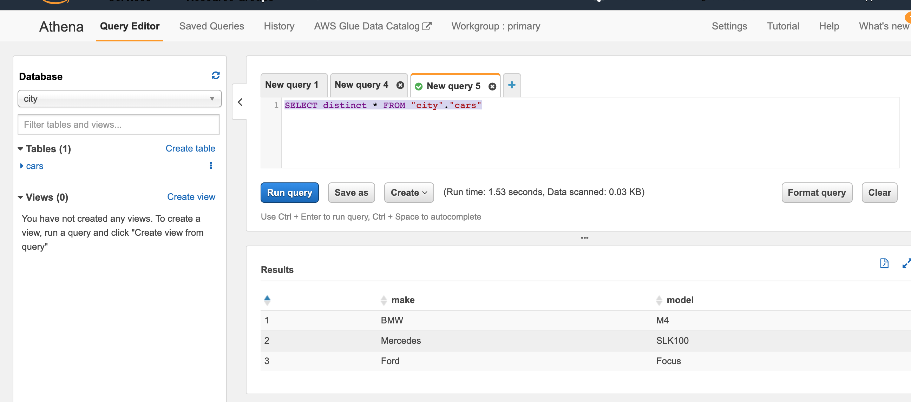
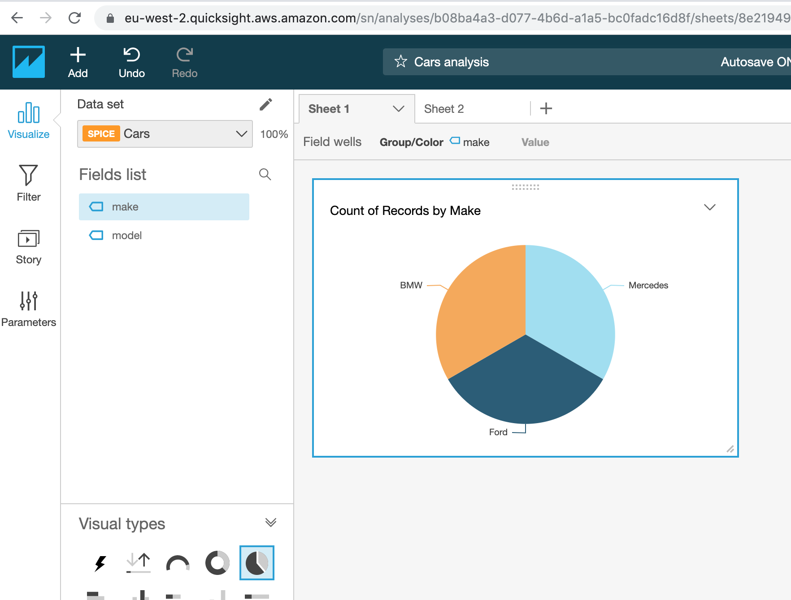

## AWS-based Serverless analytics data pipeline

### Source code
Hosted in AWS CodeCommit (for now)

### Description
This simple pipeline.

### Credits
This serverless web application was based on learning from  https://github.com/CodeRecipe-dev/bigdata-on-aws 

### Technologies used
- AWS S3
    - Static file hosting
- AWS Glue
    - Map between S3 and Athena
- AWS Athena
    - Query S3
- AWS Lambda
    - Serverless functions
- AWS QuickSight 
    - Visualize data
- AWS Kinesis
    - Real-time streaming of data from client to S3 
- AWS CodeCommit
    - Git-based source code repository
